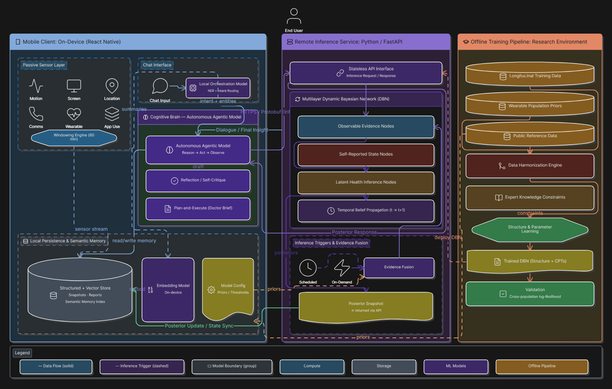

# Gliimr

### On-device personal health intelligence app. No cloud. No hallucinations.

Gliimr is a React Native health app that passively senses how you live, extracts meaning from what you say, and maintains a clinically grounded probabilistic model of your health - entirely on your phone, entirely in private, entirely explainable.

---

## ▶ [Watch Gliimr in Action](https://drive.google.com/file/d/1qspJu6YrjWRFTmhPsY4TH8R_6bGi6Vto/view?usp=drive_link)

> **[→ Live Demo Video](https://drive.google.com/file/d/1qspJu6YrjWRFTmhPsY4TH8R_6bGi6Vto/view?usp=drive_link)** - See the complete app in action.

---

## The Problem

Three gaps exist between how people actually live and what their doctor ever gets to see.

**The perception gap.** Most people don't see how physical and mental health shape each other in real time. A run of poor sleep compounds anxiety. Social withdrawal correlates with physical inactivity. These interactions are real, measurable, and almost entirely invisible to the person living them.

**The action gap.** Even if you suspect a pattern, linking daily behaviour to health outcomes is cognitively expensive. You'd need to log consistently, review trends manually, and connect dots across weeks of data. Almost no one does this.

**The clinical invisibility gap.** The richest signal a doctor could have - actual daily life, over months - never reaches the consultation room. What reaches the consultation room is a five-minute verbal summary of whatever the patient happens to remember.

Gliimr closes all three. It watches passively, reasons probabilistically, and generates a clinical handoff document that represents 180 days of evidence.

---

## What Makes This Different

Most health apps are glorified mood diaries. You tap a number, it stores it, it draws a line chart. There is no reasoning. The line chart cannot tell you why anything happened.

Gliimr is built on a fundamentally different architecture:

```
Passive sensors (15-min)  ──┐
                            ├──▶  Dynamic Bayesian Network  ──▶  Gemma agent  ──▶  Causal insight
Self-reported NLU      ──┘              (37 nodes, calibrated                    (grounded in
                                         on clinical datasets)                    posterior, not
                                                                                  hallucination)
```

The DBN maintains a calibrated posterior over your health state. When the app says your mental stress is elevated, that is not a sentiment score on your words - it is a posterior probability derived from a network trained on clinical survey data from 120 real participants. The language model receives this posterior as grounded input and communicates reasoning about it. It does not invent the reasoning from scratch.

This is the design principle that separates Gliimr from every other on-device health chat app: the LLM cannot override the DBN. If you tell the app you feel fine and the sensors and network say otherwise, the DBN's posterior stands.

---

## Architecture Overview

Gliimr runs across two completely separate environments.



### Environment 1 - Offline Training Pipeline (developer machine, Python)

This environment exists once, runs on a developer machine, and produces frozen artefacts that ship with the app.

```
NHANES (9,254 adults)     ──┐
StudentLife (49 participants) ├──▶  8-step preprocessing  ──▶  Phased Structural EM (pgmpy)
LifeSnaps (71 participants) ──┘                                         │
                                                                        ▼
                                                   cpd-tables.json
                                                   feature_node_config.json
                                                   population_norm_stats.json
```

pgmpy is used **exclusively here** - it is an offline Python dependency and is never present on-device.

### Environment 2 - On-Device Runtime (Android, TypeScript/Hermes)

This environment loads the frozen artefacts and runs entirely on-device, with zero network calls for any health data.

```
Frozen artefacts (bundle)
        +
Passive sensors (15-min background task)
        +
Natural-language conversation
        │
        ▼
TypeScript LBP inference engine  ──▶  Three-model GGUF pipeline  ──▶  Dashboard + Doctor Report
```

The Android sandbox blocks `fork`/`exec`. The Hermes JS engine does not support Node.js runtimes, ONNX runtimes, or native Python bindings. Every inference decision - including the full Loopy Belief Propagation implementation - is a TypeScript port, running inside Hermes, on-device.

---

## The Three-Model Pipeline

Running ~4.1 GB of GGUF models on a mid-range Android device is not a matter of simply loading everything at once. The architecture uses a **time-sequential singleton pattern**: only one large model is resident in memory at any time. Each model is explicitly released before the next one allocates, with a 300 ms OS reclaim pause between them.

### Model 1 - Llama 3.2-1B-Instruct Q4_K_M (~808 MB)

The NLU gatekeeper. Every non-trivial conversational turn passes through this model first.

- **Intent classification** (multi-label): reporting / social / querying / trend / third-party
- **Undo detection**: triggers targeted SQLite soft-delete, not naive row deletion
- **Named entity recognition**: three-level schema - L1 instrument column, L2 instrument-level, L3 node-level
- **Text segmentation**: splits compound messages into discrete health claims

Managed via `ensureNlu()`. Explicitly released before Gemma loads.

~60% of messages are social acknowledgements or undo operations. Routing them through Gemma (1.7 GB resident, 3–5 second cold-start) would be wasteful. Llama handles classification fast and cheaply; Gemma only loads when reasoning is genuinely required.

### Model 2 - nomic-embed-text-v1.5 Q4_K_M (~90 MB)

Semantic memory compression. Produces 768-dimensional embeddings stored via sqlite-vec (an in-process SQLite extension).

- **Why this model?** It is the only GGUF embedding model available. sentence-transformers and ONNX both require runtimes absent from Hermes.
- **Retrieval**: recency-weighted cosine similarity with log-linear hybrid decay
- **Deduplication on insertion**: near-duplicate memories update the recency weight of the existing record rather than creating a new row

### Model 3 - Gemma 4-E2B-IT Q4_K_M (~3.2 GB)

The reasoning agent. Handles structured synthesis, the conversational ReAct loop, and the 7-call Doctor Report pipeline.

- Runs at n_ctx 6144
- Only model in the 1.5–2.5 GB GGUF range with reliable structured output format adherence across 6144-token context
- Managed via `ensureAgent()`. Transparently reinitialises if Android evicts the context under memory pressure.

**Sequential loading arithmetic**: Llama releases (~808 MB freed) → 300 ms pause → nomic-embed loads (~90 MB) → releases → 300 ms pause → Gemma allocates (~3.2 GB). Peak resident: ~3.2 GB. Total pipeline footprint: ~4.1 GB, fits within the 4–8 GB budget of a mid-range Android device through sequential use rather than concurrent residence.

---

## The Dynamic Bayesian Network


### Why a DBN at All?

An LLM cannot maintain a calibrated probability distribution over health states across days. Gemma's implicit priors derive from general text corpora - they are statistical regularities of language, not clinical evidence. When the DBN reports `mental_stress: 0.73`, that posterior is computed from a network whose conditional probability tables were estimated from NHANES, StudentLife, and LifeSnaps data. It is grounded in a clinical population. Gemma receives this posterior as structured input and communicates reasoning about it. It does not invent it.

### Structure

**37 nodes, 122 intra-slice edges (72 forced + 50 learned by EM), 18 temporal self-loops.**

The network is organised into three layers:

| Layer | Type | Nodes |
|-------|------|-------|
| Layer 1 | Passive observables | sleep_quality, screen_time, activity_level, heart_rate, communication_frequency, etc. |
| Layer 2 | Self-reported EMA | mood, pain_level, loneliness, energy, depression, anxiety, etc. |
| Layer 3 | Latent inferred | mental_stress, physical_stress |

The latent nodes in Layer 3 are never self-reported by design. If a user says "I'm not stressed," the DBN ignores that claim and reasons from the observable evidence. This is intentional: it prevents the app from collapsing into a mood diary where the user's self-assessment is both the input and the output. The DBN maintains its own position.

### Training

Training runs offline in Python/pgmpy using **Phased Structural EM**:

1. **Phase 1 (40% data)**: Learn rough structure, avoiding local optima from sparse evidence
2. **Phase 2 (70% data)**: Refine structure, prune weak edges
3. **Phase 3 (100% data)**: Final CPT estimation

The E-step uses **Loopy Belief Propagation, not Variable Elimination**. VE scales exponentially with treewidth - infeasible for a 37-node cyclic graph. LBP scales linearly with edges and converges acceptably for this topology. The same algorithm is used at runtime (TypeScript port) for consistency.

**Expert knowledge enforcement**: 72 edges are hardcoded as forced constraints that Structural EM cannot remove or reverse. These encode clinical domain knowledge that the training data volume is insufficient to reliably discover on its own.

**8-step preprocessing pipeline**: prune → harmonize → normalize (produces `population_norm_stats.json`) → discretize → likelihood tables → NHANES priors → training CSV

**Why `population_norm_stats.json` is baked into the app bundle**: runtime and training discretisation thresholds must match exactly. A mismatch silently corrupts DBN evidence - wrong bin assignments propagate through the entire inference graph with no visible error. Fetching thresholds at runtime introduces a failure mode; baking them eliminates it entirely.

### Runtime Inference

pgmpy cannot run in Hermes. The entire LBP implementation is a full TypeScript port, numerically validated against the Python implementation:

- `runLBP()` - message-passing loop
- `applyInterSlice()` - temporal transitions via self-loop CPTs
- `contractLast()` / `contractAxis()` - posterior marginalisation

`selectBeliefWindow()` filters the 37-node posterior to a context budget appropriate for the current task:
- **Queries**: 15 nodes at confidence gate 0.35
- **Reports**: 8 nodes at confidence gate 0.55

---

## Conversational Pipeline

### The Fast Paths

Before any model loads, the pipeline checks for acknowledgements (static word-set lookup → deterministic response, zero model calls). ~60% of turns never touch an LLM.

### The Full Pipeline

```
User message
     │
     ▼
Acknowledgement fast path? ──yes──▶ Deterministic response
     │ no
     ▼
Llama NLU
  ├─ Undo detection ──yes──▶ SQLite soft-delete + confirm
  ├─ Intent classification
  ├─ NER (L1 → L2 → L3)
  └─ Entities written to user_data_sensorless
     │
     ▼
DBN inference
  run_dbn_inference MCP tool → inferenceEngine.ts → runLBP() → BeliefResult → selectBeliefWindow()
     │
     ▼
Llama releases (300 ms pause) → Gemma loads
     │
     ├─ Glance mode (≤400 tokens, ~10 sec total)
     └─ Reflect mode (~30 sec, first token streams in ~1 sec)
           ├─ Phase A: runReactHypothesisLoop()
           │    get_changed_nodes → get_user_memory → get_belief_trend (per node) → HYPOTHESIS:
           └─ Phase B: generator()
                ACK / CAUSE / EFFECT / LINK / SOLUTION / QUESTION labels
```

### Why Sequential ReAct?

Gemma must read the memory store before committing to which DBN nodes to probe. Batching the ReAct steps degrades node selection accuracy at 2B parameters because the model lacks evidence for relevance judgments before it has read memory. The locked sequence enforces this: `get_user_memory` always precedes `get_belief_trend`.

### Tool Safety

`dispatchTool()` is a hard TypeScript boundary. Hallucinated tool names return an error observation string. They never execute. This is enforced in code, not prompt.

### Why a Custom MCP Implementation?

The official MCP SDK uses stdio transport via `child_process.spawn`. `child_process` is absent from Hermes, and `spawn` is blocked by the Android sandbox. The custom implementation preserves MCP tool-call semantics - the same structured tool invocation pattern - within the constraints of the Hermes runtime.

---

## Doctor Report

The Doctor Report is a clinical handoff document synthesising 180 days of evidence. It is generated as a PDF via `expo-print` and shared via `expo-sharing`.

### Pattern Detection

`detectHiddenPatterns()` algorithmically classifies evidence into:

- **Tier 1**: symptom-linked patterns - temporal correlations, anomaly weeks, sustained trends
- **Tier 2**: secondary patterns - forgotten complaints, silent nodes, contradictory states

### 7-Call Sequential Gemma Pipeline

| Call | Purpose |
|------|---------|
| 1 | Load and structure 180-day memory + DBN snapshot |
| 2 | `runReportHypothesisLoop()` - locked ReAct: `get_user_memory` (180-day) → 4–5 `get_belief_trend` calls → OBSERVATION: stop token → 3–5 sentence HYPOTHESIS |
| 3 | Validate hypothesis against pattern detection output |
| 4 | Section: "Related but Possibly Missed" |
| 5 | Section: "Passive Data Patterns" |
| 6 | Section: "How This Connects" |
| 7 | Sections: "Questions for Your Doctor" + "Data Limitations" |

Each section call produces ~120 words. `applyValidators()` enforces data citations, "forgotten/silent" framing, and mandatory data limitations text across all outputs.

Sequential because Gemma cannot commit to a node list before reading the 180-day memory store. Parallelising the section calls would require Gemma to select relevant nodes without evidence - the same accuracy problem as batching ReAct.

---

## Passive Sensing

A 15-minute background task (via `expo-background-fetch` + `expo-task-manager`) runs four collectors:

| Collector | Data | Permissions |
|-----------|------|-------------|
| `clockCollector` | Time-of-day context | None - always-on |
| `activityCollector` | Step count → active_ratio | expo-pedometer |
| `screenUsageCollector` | Screen-on duration | Android UsageStats API |
| `communicationCollector` | Call + SMS metadata | Android CallLog + SMS |

**SMS content is never read.** Only metadata (frequency, timing) is collected. The communication collector measures social connectedness as a health signal, not conversation content.

**Sleep proxy**: the longest continuous screen-off window between 8 PM and 11 AM is used as a sleep duration proxy. This is never surfaced as clinical sleep data - it carries a confidence weight below self-reported sleep. Daily sleep questions in conversational onboarding have high abandonment rates within days. The screen-off proxy requires zero user action and degrades gracefully if the phone is used overnight.

---

## Semantic Memory

The embedding layer compresses conversational history for retrieval by the Gemma agent.

- **Model**: nomic-embed-text-v1.5 Q4_K_M, 768-dimensional embeddings
- **Storage**: sqlite-vec in-process SQLite extension (no separate vector database process)
- **Retrieval**: recency-weighted cosine similarity with log-linear hybrid decay - recent memories rank higher at equal semantic similarity
- **Deduplication**: cosine similarity above threshold on insertion updates the existing record's recency weight rather than creating a duplicate row. Memory stays compact over months of use.
- **Retrieval windows**: 180-day window for Doctor Report; rolling context window for conversational Reflect mode

---

## Privacy Architecture

The privacy guarantee is architectural, not policy-based.

- **Zero network calls** for any health data. No API endpoints. No analytics. No telemetry.
- **No server exists** to receive data even if you tried to send it.
- **All models run on-device** via llama.rn (GGUF runtime). The only network activity is the one-time model download from Hugging Face at first launch.
- **Communication metadata only**: call frequency and SMS frequency as social connectedness signals. Message content is never accessed.
- **DBN latent nodes**: `mental_stress` and `physical_stress` are inferred, never stored as user-reported values. The app holds a probabilistic belief, not a diagnosis.

If you uninstall the app, everything is gone. There is no account. There is no server-side copy.

---

## Research Foundation

The DBN's conditional probability tables are grounded in three datasets:

### StudentLife
49 university students, 10-week semester. Android phone passive sensing + Ecological Momentary Assessment. Validated instruments: PHQ-9 (depression), PSS-10 (stress), PANAS (18-item affect), UCLA Loneliness Scale (20-item), VR-12 (health), Big Five (extraversion + neuroticism). Primary CPT training dataset.

### LifeSnaps
71 participants. Fitbit wearable data (BPM, resting HR, Fitbit sleep stages) + phone sensors. Used for wearable sensor validation of passive sensing node CPTs.

### NHANES
9,254 US adults. National Health and Nutrition Examination Survey. Used exclusively for population priors - NHANES never enters the training CSV. Its role is to initialise CPT priors at clinically grounded base rates before Structural EM refines them on the StudentLife/LifeSnaps population.

**Instruments used in training** (shape CPT values during Structural EM, then disappear at runtime - no raw scores are stored or used on-device):

PHQ-9 · PSS-10 · PANAS (18 items) · UCLA Loneliness Scale (20 items) · VR-12 · Big Five (extraversion + neuroticism)

---

## Technical Challenges Solved

| Challenge | Solution |
|-----------|----------|
| ~4.1 GB models on 4–8 GB device | Sequential singleton loading with 300 ms OS reclaim pause between deallocate and allocate |
| Android eviction under memory pressure | `ensureAgent()` / `ensureNlu()` reinitialise transparently from the stored GGUF path with no user-visible failure |
| pgmpy unavailable in Hermes | Full TypeScript LBP port (`runLBP`, `applyInterSlice`, `contractLast`, `contractAxis`) numerically validated against Python reference |
| Training/runtime discretisation mismatch silently corrupts DBN evidence | `population_norm_stats.json` baked into app bundle at build time - no runtime fetch, no version skew |
| Gemma format deviation in long generation sequences | `dispatchTool()` hard TypeScript boundary + stop-token termination; hallucinated tool names return error string, never execute |
| Official MCP SDK uses `child_process.spawn` (absent from Hermes, blocked by Android sandbox) | Custom MCP implementation preserving tool-call semantics within Hermes constraints |
| Daily sleep questions abandoned within days | Screen-off window proxy (8 PM–11 AM longest continuous gap), fully automatic, zero user action required |
| `Variable Elimination` infeasible for 37-node cyclic graph (exponential treewidth scaling) | Loopy Belief Propagation - linear in edges, consistent between offline training and on-device runtime |

---

## Stack

### On-Device (Runtime)

| Component | Technology |
|-----------|------------|
| Framework | React Native 0.81.5 / Expo 54 / TypeScript |
| JS Engine | Hermes |
| GGUF Runtime | llama.rn 0.12.0 |
| Database | @op-engineering/op-sqlite 15.2.12 + sqlite-vec extension |
| Background tasks | expo-background-fetch / expo-task-manager |
| Sensors | expo-sensors (pedometer) + Android UsageStats + Android CallLog/SMS native modules |
| PDF generation | expo-print + expo-sharing |
| Animations | react-native-reanimated 3.19.5 + react-native-svg |

### Offline Training Only (Developer Machine)

| Component | Technology |
|-----------|------------|
| DBN training | Python + pgmpy |
| Preprocessing | numpy + pandas + scikit-learn |

pgmpy is **not** an on-device dependency.

---

## Setup

### Training Pipeline (offline, developer machine)

Requirements: Python 3.10+, pgmpy, numpy, pandas, scikit-learn

```bash
# Install training dependencies
pip install pgmpy numpy pandas scikit-learn

# Run preprocessing
cd training
python preprocess.py        # 8-step pipeline → training CSV
python train_dbn.py         # Phased Structural EM → cpd-tables.json

# Outputs:
#   cpd-tables.json              - conditional probability tables
#   feature_node_config.json     - node metadata and edge definitions
#   population_norm_stats.json   - discretisation thresholds (baked into bundle)
```

### Mobile App

Requirements: Node.js 18+, Expo CLI, Android device or emulator (API 26+)

```bash
# Install dependencies
npm install

# Start development build
npx expo run:android

# First launch: ModelDownloadScreen handles GGUF downloads from Hugging Face
# Models downloaded once, stored in app's document directory:
#   Llama 3.2-1B-Instruct Q4_K_M   (~808 MB)
#   nomic-embed-text-v1.5 Q4_K_M   (~90 MB)
#   Gemma 4-E2B-IT Q4_K_M          (~3.2 GB)
```

**Note**: iOS is not currently supported. The passive sensing layer uses Android-specific APIs (UsageStats, CallLog). iOS support is planned for Phase 2.

---

## Author

Built by **Udbhav Narayan Sharma** - solo, end-to-end, across the full stack from clinical dataset preprocessing through probabilistic inference to complete on-device LLM orchestration.

The design constraint of zero data egress was not a product decision. It was the premise. Everything else - the sequential singleton loading, the TypeScript LBP port, the custom MCP implementation, the DBN's latent-node architecture - follows from taking that constraint seriously.

---

*If a system can't explain with surity why it thinks you're stressed, it probably shouldn't be telling you.*

---

*Gliimr is not a medical device and does not provide medical advice. The Doctor Report is an evidence summary intended to support conversations with a clinician, not replace them.*
